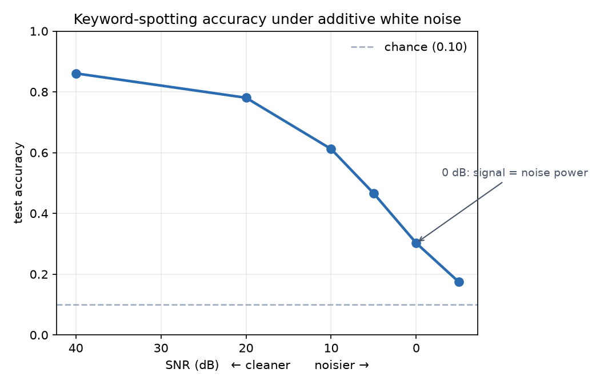
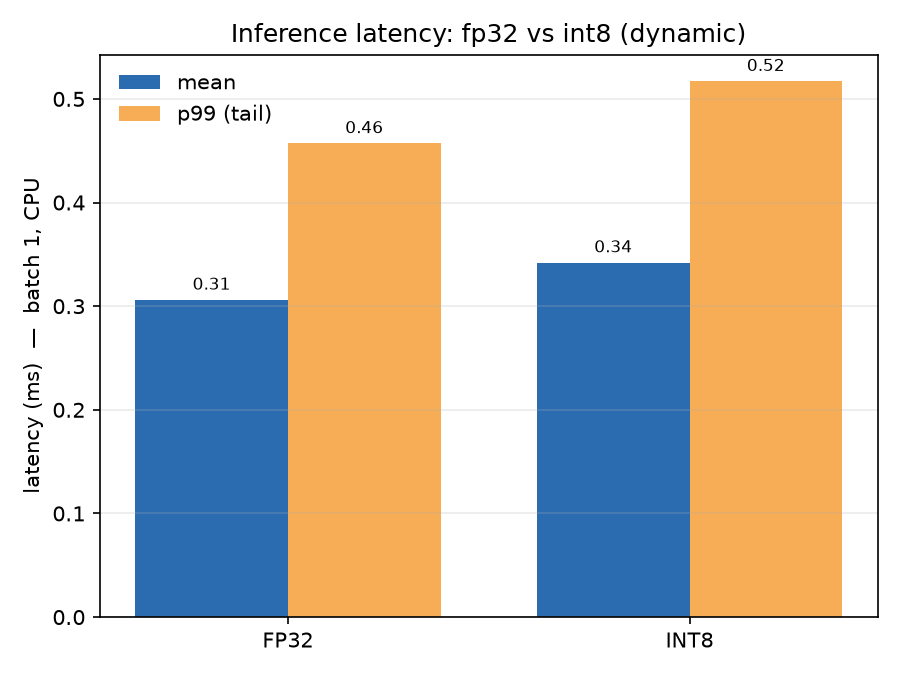

# edge-audio-bench

Taking a small audio model from prototype to real-time inference on constrained
hardware, and measuring how it holds up as conditions get noisy. A deliberate
miniature of the deployment step in real edge-audio systems: the model is the
easy part; making it run fast enough, small enough, and robustly enough to
survive the real world is the work.

## Results

TinyKWS (14.5k params) reaches 0.873 validation accuracy on a 10-word keyword
spotting task. The point of the project is what happens next: how it holds up
under noise, and what it costs to run in real time.

### Robustness to noise



| SNR (dB) | accuracy |
|---------:|---------:|
| 40 (~clean) | 0.861 |
| 20 | 0.781 |
| 10 | 0.612 |
| 5  | 0.466 |
| 0  | 0.302 |
| -5 | 0.175 |

Accuracy holds up to ~20 dB, degrades roughly linearly through the mid-SNR
range, and collapses toward chance (0.10) around 0 dB, the point where noise
power equals speech power. Breaking down exactly at signal/noise parity is the
check that the sweep behaves physically.

### Real-time latency, and the quantization finding



Batch-1 CPU inference: fp32 runs at 0.40 ms mean / 0.50 ms p99 (~2,500
inferences/sec), far inside any real-time budget.

Dynamic int8 quantization is slightly *slower* here (0.43 ms mean, 0.75 ms p99),
and that is the intended finding, not a failure. Dynamic quantization only
converts `Linear` layers, and TinyKWS is convolution-dominated with one small
linear head, so it quantizes ~2% of the compute while adding quant/dequant
overhead that surfaces in the tail. The real lever for a conv-dominated model is
static quantization with calibration, or an exported runtime such as ONNX
Runtime, which is the natural next step.

### Caveats
- Noise is additive white Gaussian. Structured real-world noise (babble, wind,
  reverberation) is harder and is the next robustness axis to test.
- The quantization result is a deliberate diagnostic of head-only dynamic quant,
  not a claim of a speedup.

## How it works

Waveform → log-mel spectrogram → small CNN → keyword. Noise is injected at the
waveform level at a controlled SNR, so it propagates through feature extraction
the way real acoustic noise would.

- `src/noise.py` — SNR-controlled noise mixing (verified exact to 2 dp)
- `src/features.py` — log-mel feature extraction
- `src/model.py` — TinyKWS, a compact CNN, plus int8 dynamic quantization
- `src/data.py` — Speech Commands, filtered to 10 keywords
- `src/train.py` — training with cosine LR schedule
- `src/evaluate.py` — accuracy-vs-noise sweep
- `src/bench_quant.py` — fp32 vs int8 latency
- `analysis/plot_results.py` — the figures above

## Reproduce

```bash
pip install -r requirements.txt   # requires system ffmpeg (apt install ffmpeg)
python src/train.py               # trains TinyKWS, saves checkpoint
python src/evaluate.py            # writes results/accuracy_vs_noise.csv
python src/bench_quant.py         # writes results/latency.csv
python analysis/plot_results.py   # writes the plots
```
